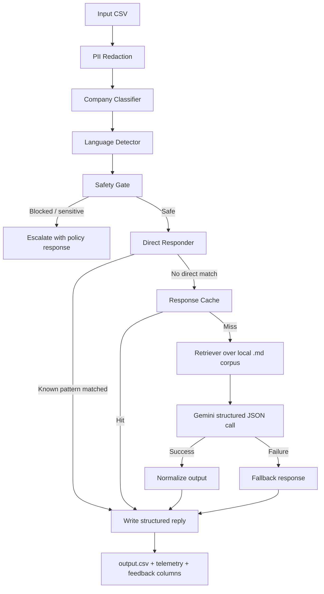

# HackerRank Orchestrate Support Agent

An AI support pipeline for the **HackerRank Orchestrate 2026** hackathon that reads support tickets from CSV, classifies the company, blocks unsafe or abusive requests, retrieves grounded help content from the local corpus, and produces structured support decisions in `support_tickets/output.csv`.

This submission is designed to be strong on the criteria that matter most in the hackathon:
- **Accuracy over bravado**: it answers when the corpus supports an answer and escalates when it does not.
- **Safety first**: prompt injection, account-takeover requests, fraud-style requests, and sensitive access issues are intercepted before generation.
- **Explainability**: every row includes a user-facing response plus a concise justification.
- **Operational resilience**: the pipeline has deterministic fast paths, structured fallbacks, telemetry, caching, and feedback hooks.

Read the official challenge docs here:
- [problem_statement.md](/Users/dotspeaks/Documents/hackerrank-orchestrate-may26/problem_statement.md)
- [evalutation_criteria.md](/Users/dotspeaks/Documents/hackerrank-orchestrate-may26/evalutation_criteria.md)

**What This Agent Does**
It processes each ticket row-by-row and outputs:

| Column | Meaning |
| --- | --- |
| `status` | `replied` or `escalated` |
| `product_area` | normalized support category |
| `response` | customer-facing answer |
| `justification` | short reasoning for the decision |
| `request_type` | `product_issue`, `feature_request`, `bug`, or `invalid` |
| `confidence_score` | confidence assigned by the pipeline |

The current system supports tickets across:
- `HackerRank`
- `Claude`
- `Visa`

**Why This Submission Is Competitive**
- It is not a single LLM call. It is a layered decision system with rule-based safety, corpus-grounded retrieval, direct responders, structured Gemini output, and offline fallbacks.
- It avoids unnecessary escalations on many common support flows such as subscription pause, certificate name updates, account removal guidance, charge disputes, Bedrock support routing, and crawler controls.
- It handles failure modes gracefully. If the model is unavailable or rate-limited, the system still returns structured output instead of crashing.
- It produces machine-evaluable CSV output while also remaining easy to explain in a judge interview.

**Architecture**



**Feature Breakdown**

| Feature | Why it matters | File |
| --- | --- | --- |
| PII redaction | Removes sensitive patterns before deeper processing | [privacy_filter.py](/Users/dotspeaks/Documents/hackerrank-orchestrate-may26/code/privacy_filter.py) |
| Company detection | Routes tickets to the right corpus even when the CSV company is blank | [classifier.py](/Users/dotspeaks/Documents/hackerrank-orchestrate-may26/code/classifier.py) |
| Language detection | Detects non-English tickets and routes them safely | [language_detector.py](/Users/dotspeaks/Documents/hackerrank-orchestrate-may26/code/language_detector.py) |
| Safety gate | Blocks prompt injection, unauthorized access requests, abuse, and risky payment/security scenarios | [safety_gate.py](/Users/dotspeaks/Documents/hackerrank-orchestrate-may26/code/safety_gate.py) |
| Direct responders | Answers clearly-supported tickets without spending model calls | [direct_responder.py](/Users/dotspeaks/Documents/hackerrank-orchestrate-may26/code/direct_responder.py) |
| Corpus retrieval | Scores support docs and extracts the strongest matching passages | [retriever.py](/Users/dotspeaks/Documents/hackerrank-orchestrate-may26/code/retriever.py) |
| Structured LLM output | Uses Gemini with schema-constrained JSON output | [agent.py](/Users/dotspeaks/Documents/hackerrank-orchestrate-may26/code/agent.py) |
| Product area normalization | Prevents messy or hallucinated labels from leaking into the final CSV | [agent.py](/Users/dotspeaks/Documents/hackerrank-orchestrate-may26/code/agent.py) and [main.py](/Users/dotspeaks/Documents/hackerrank-orchestrate-may26/code/main.py) |
| Response cache | Reuses answers for near-duplicate tickets within the same company | [response_cache.py](/Users/dotspeaks/Documents/hackerrank-orchestrate-may26/code/response_cache.py) |
| Telemetry trace | Records the path taken for each ticket for auditability | [telemetry_logger.py](/Users/dotspeaks/Documents/hackerrank-orchestrate-may26/code/telemetry_logger.py) |
| Feedback hooks | Adds CSAT-ready columns and a feedback analytics workflow | [feedback_collector.py](/Users/dotspeaks/Documents/hackerrank-orchestrate-may26/code/feedback_collector.py) |

**Examples of Behaviors This Agent Handles Well**
- Unauthorized Claude seat restoration requests are escalated as access-control issues.
- Claude on Amazon Bedrock questions are routed to AWS support guidance.
- Claude crawler / `robots.txt` questions get direct grounded answers.
- HackerRank certificate-name updates and subscription pauses get direct help.
- HackerRank account-removal guidance for recruiters or users is answered from corpus-backed admin docs.
- Visa dispute-charge and urgent-cash questions are answered without over-escalating.
- Prompt-injection attempts are blocked and marked `invalid`.
- Vague tickets are answered with a clarification request instead of a random guess.

**Quick Start**

1. Clone the repo and enter the code directory.

```bash
git clone https://github.com/interviewstreet/hackerrank-orchestrate-may26.git
cd hackerrank-orchestrate-may26/code
```

2. Create a virtual environment and install dependencies.

```bash
python3 -m venv venv
source venv/bin/activate
pip install -r requirements.txt
```

3. Add your Gemini API key.

```env
GEMINI_API_KEY=your_api_key_here
GEMINI_MODEL=gemini-2.5-flash
```

4. Run the pipeline.

```bash
python3 main.py
```

5. Review the outputs.
- Main predictions: [support_tickets/output.csv](/Users/dotspeaks/Documents/hackerrank-orchestrate-may26/support_tickets/output.csv)
- Telemetry trace: [support_tickets/system_trace.jsonl](/Users/dotspeaks/Documents/hackerrank-orchestrate-may26/support_tickets/system_trace.jsonl)

**How the Main Entry Point Works**

The evaluation entry point is [main.py](/Users/dotspeaks/Documents/hackerrank-orchestrate-may26/code/main.py). For each CSV row it:

1. Normalizes cells and redacts basic PII.
2. Detects the likely company if missing.
3. Detects non-English cases.
4. Runs the safety gate.
5. Tries a deterministic direct response.
6. Checks the response cache for near-duplicates.
7. Retrieves relevant support passages from the local corpus.
8. Calls Gemini for a structured JSON decision.
9. Falls back safely if the API fails.
10. Normalizes the final output and writes the row to CSV.

**Testing and Validation**

The repo already contains multiple ways to validate the system.

**1. Main batch run**
- Input: [support_tickets/support_tickets.csv](/Users/dotspeaks/Documents/hackerrank-orchestrate-may26/support_tickets/support_tickets.csv)
- Output: [support_tickets/output.csv](/Users/dotspeaks/Documents/hackerrank-orchestrate-may26/support_tickets/output.csv)
- Best for: end-to-end evaluation on the provided challenge dataset

**2. Adversarial stress test**
- Script: [test_adversarial.py](/Users/dotspeaks/Documents/hackerrank-orchestrate-may26/code/test_adversarial.py)
- Best for: multi-intent abuse, prompt injection, payment/security overlap, and risky escalation paths

Run it with:

```bash
cd /Users/dotspeaks/Documents/hackerrank-orchestrate-may26/code
source venv/bin/activate
python3 test_adversarial.py
```

**3. Synthetic adversarial CSV generation**
- Generator: [generate_test_csv.py](/Users/dotspeaks/Documents/hackerrank-orchestrate-may26/code/generate_test_csv.py)
- Best for: creating a separate CSV you can run through `main.py`

```bash
cd /Users/dotspeaks/Documents/hackerrank-orchestrate-may26/code
python3 generate_test_csv.py
python3 main.py --input /Users/dotspeaks/Documents/hackerrank-orchestrate-may26/code/adversarial_input.csv --output /Users/dotspeaks/Documents/hackerrank-orchestrate-may26/support_tickets/adversarial_output.csv
```

**4. Feedback / CSAT workflow**
- Log file: [support_tickets/feedback.jsonl](/Users/dotspeaks/Documents/hackerrank-orchestrate-may26/support_tickets/feedback.jsonl)
- Tool: [feedback_collector.py](/Users/dotspeaks/Documents/hackerrank-orchestrate-may26/code/feedback_collector.py)

Example:

```bash
python3 feedback_collector.py submit --ticket_id 2 --score 5 --comment "Resolved instantly"
python3 feedback_collector.py report
```

**Artifacts That Help in Judge Review**
- [support_tickets/output.csv](/Users/dotspeaks/Documents/hackerrank-orchestrate-may26/support_tickets/output.csv): final predictions
- [support_tickets/system_trace.jsonl](/Users/dotspeaks/Documents/hackerrank-orchestrate-may26/support_tickets/system_trace.jsonl): decision path per ticket
- [support_tickets/feedback.jsonl](/Users/dotspeaks/Documents/hackerrank-orchestrate-may26/support_tickets/feedback.jsonl): optional CSAT evidence
- [AGENTS.md](/Users/dotspeaks/Documents/hackerrank-orchestrate-may26/AGENTS.md): enforced logging and operational rules

**Repository Layout**

```text
.
├── AGENTS.md
├── README.md
├── problem_statement.md
├── evalutation_criteria.md
├── code/
│   ├── main.py
│   ├── agent.py
│   ├── classifier.py
│   ├── direct_responder.py
│   ├── feedback_collector.py
│   ├── language_detector.py
│   ├── multi_intent.py
│   ├── privacy_filter.py
│   ├── response_cache.py
│   ├── retriever.py
│   ├── safety_gate.py
│   ├── sentiment_analyzer.py
│   ├── telemetry_logger.py
│   └── requirements.txt
├── data/
│   ├── claude/
│   ├── hackerrank/
│   └── visa/
└── support_tickets/
    ├── support_tickets.csv
    ├── output.csv
    ├── feedback.jsonl
    ├── response_cache.jsonl
    └── system_trace.jsonl
```

**Judge Interview Talking Points**
- Why the system uses a hybrid pipeline instead of raw prompting
- How the safety gate prevents abuse and unauthorized actions
- Why deterministic direct responders reduce unnecessary escalations
- How retrieval grounding and output normalization improve consistency
- What happens when Gemini fails or rate limits
- How telemetry and feedback make the system auditable and improvable

**Submission Checklist**
- `code/` is zipped and uploaded
- `support_tickets/output.csv` is generated
- chat transcript log from `$HOME/hackerrank_orchestrate/log.txt` is available
- `.env` is not committed
- API keys are kept in environment variables only

**One-Line Pitch**

This project is a **safe, explainable, hackathon-ready support agent** that combines deterministic support logic with corpus-grounded LLM reasoning so it can answer the easy tickets fast, escalate the risky ones correctly, and stay reliable under real-world failure modes.
